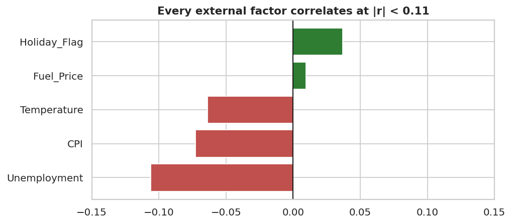
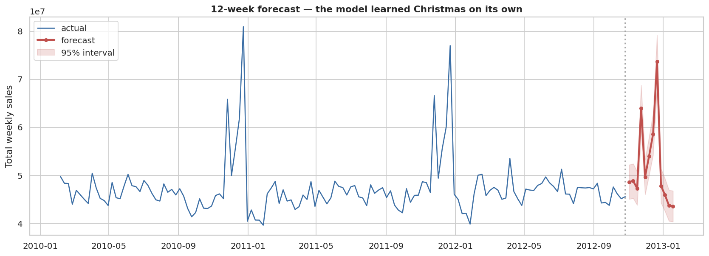
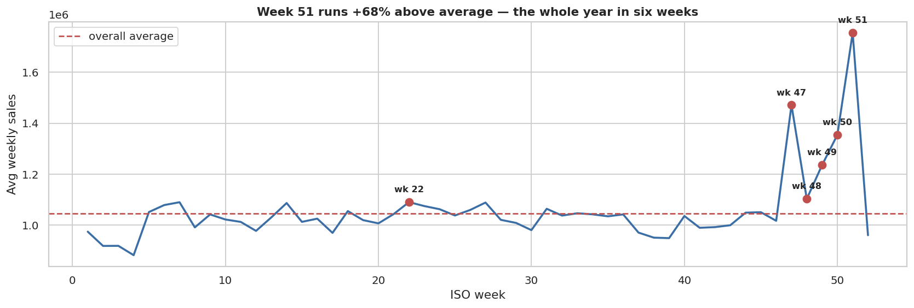
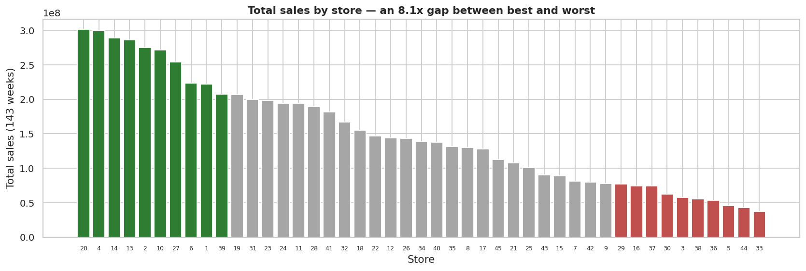
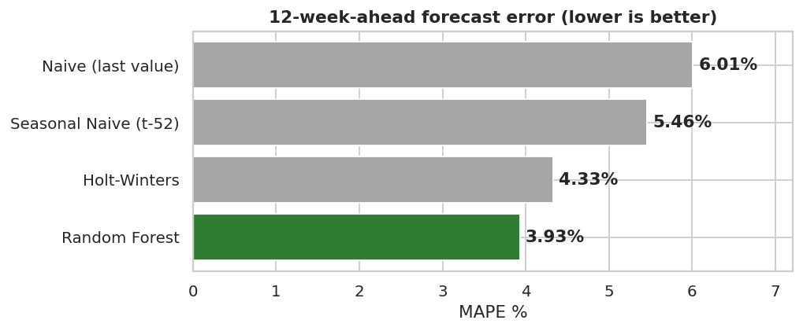
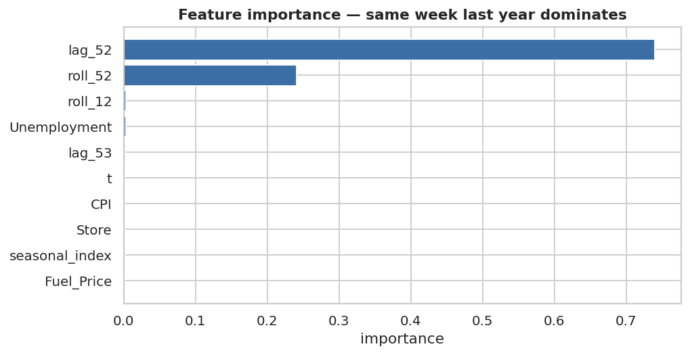

# Walmart Retail Demand Analysis & Sales Forecasting

Statistical analysis and 12-week demand forecasting across 45 retail outlets, built to answer one operational question: **what should each store actually stock, and when?**

[](https://www.python.org/)

Full Dashboard App : https://burtiwalmartsalesforecasting-gabwdn9afbf4emqtt5hp6j.streamlit.app/
Full notebook : notebooks/Walmart_Sales_Analysis_and_Forecasting.ipynb

## The headline finding

Every external variable in this dataset is nearly useless for predicting sales.



Unemployment, CPI, temperature, fuel price and the holiday flag each correlate with weekly sales at **|r| < 0.11**. Together they explain about **2%** of the variation. In the trained model, all of them combined account for roughly **1%** of feature importance.

What actually drives sales is **which store it is** and **which week of the year it is**. This business runs on the calendar, not the economy — and that single conclusion reshapes how you'd plan inventory for it.

---

## Results

| | |
|---|---|
| **Forecast accuracy** | **3.93% MAPE**, 12 weeks ahead, on a holdout containing Thanksgiving and Christmas |
| **Beats** | Holt-Winters (4.33%), seasonal naive (5.46%), naive (6.01%) |
| **Peak week** | Week 51 runs **+68%** above average |
| **Best vs worst store** | **8.11x** gap, Cohen's d = **9.44**, distributions don't overlap |
| **Revenue concentration** | Top 10 stores = **39%** of chain revenue |



The model ramps through November, spikes at Thanksgiving and again pre-Christmas, then drops into January — the correct shape, with no hand-coded holiday rule. That's the seasonal signal in `lag_52` doing its job.

---

## Three decisions that shaped this project

Most of the value here isn't in the model architecture. It's in three judgement calls where the obvious move would have been wrong.

### 1. We kept the outliers

The textbook move is to apply the IQR rule and drop what falls outside the fences. Here that would delete Christmas.

All **34** globally extreme weeks fall in **November and December**. They aren't errors — they're Thanksgiving and Christmas, and they're precisely the weeks the inventory team most needs to get right. Dropping them produces a model that's blind to the only season that matters.

Instead we judge outliers **within each store**, which surfaces ~300 genuinely unusual weeks. A 900k week is routine for Store 20 and an all-time record for Store 33; only a per-store test can tell the difference.

### 2. We refused to use `lag_1`

Feeding the model last week's sales scores better — **3.67% MAPE** in testing. But it's a lie. To predict week 12 you'd need week 11's actuals, which don't exist yet. A lag-1 model is a one-step-ahead model wearing a twelve-step-ahead costume.

Every feature here is one we genuinely have at forecast time. There's a [test that fails](tests/test_pipeline.py) if anyone reintroduces a short lag:

```python
def test_no_short_lag_features():
    """No feature may depend on data inside the forecast horizon."""
    for col in FEATURE_COLUMNS:
        if col.startswith("lag_"):
            assert int(col.split("_")[1]) >= HORIZON, f"{col} leaks future data"
```

The honest version still hits **3.93%**.

### 3. We didn't call the worst store "underperforming"

Store 33 does 8.11x less volume than Store 20, with no distributional overlap whatsoever — Store 20's worst week in three years beats Store 33's best week. Statistically this is about as significant as a difference gets (p ≈ 3.5e-121).

But Store 33 is also one of the **least volatile** stores in the chain (CV 9.3%). That pattern says *small store, consistent* — not *large store, failing*. Gaps this clean and stable are structural: format, square footage, catchment population. The right benchmark for Store 33 is Stores 44, 5, 36 and 38, where it sits mid-pack.

Calling it a problem store would send the inventory team chasing a fix for something that isn't broken.

---

## The six business questions

<details>
<summary><b>(a) Do weekly sales respond to the unemployment rate?</b></summary>

**Yes, but only for a handful of stores — and the pooled statistic hides this completely.**

Chain-wide r = **−0.106**, explaining ~1% of variance. Statistically significant (p ≈ 1e-17), but significance is cheap with 6,435 rows. Break it out per store:

- **Store 38 (r = −0.79)** and **Store 44 (r = −0.78)** are severely exposed
- Stores 39, 42, 41, 4 show moderate sensitivity (r ≈ −0.34 to −0.39)
- **16 of 45 stores show *positive* correlations** — consistent with trade-down behaviour, where shoppers switch to a value retailer during a downturn

Two different questions get conflated under "suffering most":

| Definition | Stores |
|---|---|
| Most *sensitive* to unemployment changes | **38, 44**, then 39, 42, 41, 4 |
| Operating in the *worst* labour markets | **12, 38, 28** (~13.1%), then 43, 34, 29 |

**Store 38 is on both lists** — high unemployment, high sensitivity, low volume. The most economically fragile outlet in the chain.

**Practical read:** don't apply a chain-wide unemployment adjustment; it'd be noise for 40 of 45 stores. Build a local economic trigger for the six sensitive ones.
</details>

<details>
<summary><b>(b) Is there a seasonal trend?</b></summary>

**Yes — strong, highly repeatable, and the dominant force in the data.**



| Period | Weeks | Behaviour | Driver |
|---|---|---|---|
| **Peak** | Week 51 | **+68%** | Pre-Christmas gifting, food, decorations |
| **Secondary peak** | Week 47 | **+41%** | Black Friday |
| **Shoulder** | Weeks 48–50 | +5% to +29% | Christmas build-up |
| **Trough** | Weeks 1–4 | **−12%** | Post-holiday hangover, credit-card bills, weather |
| Minor bump | Week 22 | +4% | Memorial Day |

**A real modelling trap worth knowing about.** `Holiday_Flag` shows only a **+7.8%** lift (p = 0.008) because it marks the week *containing* each holiday. Christmas Day falls in week 52 — but the shopping happens in **week 51**, which isn't flagged at all despite being the biggest week of the year. **Week-of-year is a far better feature than `Holiday_Flag`.**

The 2010 and 2011 curves track each other closely. That repeatability is what makes the season forecastable.
</details>

<details>
<summary><b>(c) Does temperature affect weekly sales?</b></summary>

**Marginally, and mostly as a proxy for season.**

Pooled r = **−0.064** (0.4% of variance). But the relationship is an **inverted U**, not a line — which is exactly why the linear correlation looks so weak:

| Band | Avg weekly sales | vs overall |
|---|---|---|
| Freezing (<30°F) | 1,017,733 | −2.8% |
| **Cold (30–50°F)** | **1,118,767** | **+6.9%** |
| Mild (50–70°F) | 1,047,742 | +0.1% |
| Warm (70–90°F) | 1,024,005 | −2.2% |
| **Hot (>90°F)** | **796,966** | **−23.9%** |

The cold-band peak is largely **Christmas in disguise** — that band contains November and December in most regions. The hot-weather drop is more likely real footfall suppression: 30 of 45 stores show negative correlations, with Stores 10, 12, 3, 28 most affected. Store 44 is the one clear exception (r = +0.27).

**Practical read:** don't plan inventory *volume* off temperature. Use it for **category mix**.
</details>

<details>
<summary><b>(d) How is CPI affecting sales?</b></summary>

**Almost not at all chain-wide, but it cleanly segments the stores.**

Pooled r = **−0.073** (0.5% of variance).

**The structural insight:** CPI varies ~**91 points between** stores but only ~**10 points within** a store across three years. CPI here is primarily a **regional label** and only secondarily a time series — stores fall into distinct cost-of-living clusters that likely map to different metro areas.

Within-store correlations range from **−0.92 to +0.81**, median near zero:

- **Genuinely inflation-hurt:** Store 36 (r = −0.92) stands alone; then 35, 14, 30, 43
- **Positively associated:** Stores 38 (+0.81), 44 (+0.74) sit in the *lowest*-CPI region — there, rising CPI and rising sales are both symptoms of a recovering local economy, not cause and effect
- **~25 stores** show no usable relationship at all

**Practical read:** treat CPI as a cost-of-living cohort for pricing and assortment. Only Store 36 warrants a real inflation trigger.
</details>

<details>
<summary><b>(e) Top performing stores</b></summary>

| Rank | Store | Total (143 wks) | Avg weekly | Share | Volatility |
|---|---|---|---|---|---|
| 1 | **20** | 301.4M | 2,107,677 | 6.40% | 13.1% |
| 2 | **4** | 299.5M | 2,094,713 | 6.36% | 12.7% |
| 3 | **14** | 289.0M | 2,020,978 | 6.14% | 15.7% |
| 4 | **13** | 286.5M | 2,003,620 | 6.09% | 13.3% |
| 5 | **2** | 275.4M | 1,925,751 | 5.85% | 12.3% |

**Stores 20 and 4 are effectively tied** — separated by less than a single week's sales across three years. Treat them as joint leaders.

The top 10 generate **39.1%** of revenue from 22% of the store count. They're also the most *consistent* (CV 12–16%), which makes them the most forecastable — a 1% accuracy gain on Store 20 is worth more in absolute dollars than a 7% gain on Store 33.
</details>

<details>
<summary><b>(f) Worst performing store and the size of the gap</b></summary>



**Store 33**: 37.2M total, 259,862/week, **0.79%** of chain revenue.

| Measure | Result |
|---|---|
| Absolute gap vs Store 20 | **264,237,570** |
| Ratio | **8.11x** |
| Welch t-test | t = 79.8, p ≈ 3.5e-121 |
| Cohen's d | **9.44** (0.8 is conventionally "large") |
| Distributions overlap? | **No** — best store's worst week beats worst store's best week |
| ANOVA across 45 stores | F = 1,613, p ≈ 0 |

See [decision 3](#3-we-didnt-call-the-worst-store-underperforming) for why this is structural rather than a performance problem.
</details>

---

## What I'd recommend to the business

1. **Plan on the calendar, not the economy.** Start the Christmas stock build at **week 44**, target full readiness by **week 47** and **week 51**.
2. **Cut January hard.** Weeks 1–4 are the annual low. Carrying December inventory into January is the most likely source of markdown losses.
3. **Segment inventory policy by store tier.** An 8x volume gap makes a uniform replenishment policy actively harmful — it will chronically overstock Store 33 and starve Store 20.
4. **Put economic triggers only where they belong.** Monitor local unemployment for Stores **38 and 44**, CPI for **Store 36**. Ignore both everywhere else.
5. **Use the prediction intervals.** Set safety stock from `Upper_95` for high-value stores during peak weeks; the point forecast is fine mid-year.
6. **Refresh weekly, retrain quarterly.** The model leans on `lag_52`, so it needs a full year of history per store.

---

## Modelling approach



Four approaches on the same **time-ordered** holdout — the final 12 weeks, deliberately chosen because they span Thanksgiving, Christmas and the January collapse. No random splits; that would scatter future weeks into training and produce a meaningless score.

| Model | MAPE | Note |
|---|---|---|
| **Random Forest** | **3.93%** | Winner |
| Holt-Winters | 4.33% | Struggles — 143 weeks is thin for a 52-period season |
| Seasonal naive | 5.46% | Strong baseline; proof seasonality dominates |
| Naive | 6.01% | The floor |

**Seasonal naive at 5.46% is the number to dwell on.** Simply repeating last year gets you within 5.5%, which independently confirms the business is driven by a stable annual cycle. The Random Forest wins because it learns store-specific seasonal shapes *and* borrows strength across all 45 stores at once, where Holt-Winters fits each store in isolation.

### Features



| Feature | Available 12 weeks out? | Why |
|---|---|---|
| `Store`, `WeekOfYear`, `Month` | Yes | It's a calendar |
| `week_sin`, `week_cos` | Yes | Cyclical encoding — week 52 and week 1 are neighbours |
| `Holiday_Flag` | Yes | Holiday dates are known years ahead |
| `lag_52`, `lag_53` | Yes | 52 > 12, already observed |
| `roll_12`, `roll_52` | Yes | Shifted by the full horizon *before* rolling |
| `seasonal_index` | Yes | `lag_52 / roll_52` — separates "it's Christmas" from "this store grew" |
| `Temperature`, `CPI`, `Fuel_Price`, `Unemployment` | **Estimated** | Seasonal average / carried forward |

We genuinely don't know December's temperature or CPI in advance, so they're estimated honestly rather than assumed known. Since they carry ~1% of importance, the cost of getting them slightly wrong is negligible.

---

## Quick start

```bash
git clone https://github.com/YOUR_USERNAME/walmart-sales-forecasting.git
cd walmart-sales-forecasting

python -m venv .venv && source .venv/bin/activate   # Windows: .venv\Scripts\activate
pip install -r requirements.txt
```

**Run the dashboard**

```bash
streamlit run app/streamlit_app.py
```

**Run the pipeline** (regenerates every CSV and figure)

```bash
python run_pipeline.py
```

**Run the notebook**

```bash
jupyter lab notebooks/Walmart_Sales_Analysis_and_Forecasting.ipynb
```

**Run the tests**

```bash
pytest tests/ -v
```

---

## Deploying

The dashboard deploys free on **Streamlit Community Cloud**:

1. Push this repo to GitHub (public).
2. Go to [share.streamlit.io](https://share.streamlit.io) and sign in with GitHub.
3. **New app** → pick this repo → main file path `app/streamlit_app.py` → **Deploy**.
4. Copy the resulting URL into the badge at the top of this README.

First load takes 30–60 seconds while the model trains, then everything is cached. A `.streamlit/config.toml` is included so the theme matches the charts.

<details>
<summary>Other options</summary>

**Hugging Face Spaces** — create a Space with the Streamlit SDK, push the repo, set `app_file: app/streamlit_app.py` in the Space's README front-matter.

**Docker**

```bash
docker build -t walmart-dashboard .
docker run -p 8501:8501 walmart-dashboard
```

**Notebook only** — GitHub renders `.ipynb` natively, so the notebook is browsable without deploying anything. For interactive execution, add a Binder badge pointing at the repo.
</details>

---

## Repository structure

```
walmart-sales-forecasting/
├── app/
│   └── streamlit_app.py          # 6-page interactive dashboard
├── data/
│   └── Walmart_DataSet.csv       # 6,435 rows × 8 columns
├── notebooks/
│   └── Walmart_Sales_Analysis_and_Forecasting.ipynb
├── src/
│   ├── data_prep.py              # loading, cleaning, calendar features
│   ├── features.py               # leak-free feature engineering
│   ├── analysis.py               # the six business questions
│   └── model.py                  # baselines, validation, forecasting
├── tests/
│   ├── test_pipeline.py          # 15 tests incl. the leakage guard
│   └── test_app.py               # every dashboard page renders
├── outputs/
│   ├── figures/                  # charts used in this README
│   └── *.csv                     # forecast and ranking exports
├── run_pipeline.py               # CLI: clean → analyse → forecast → export
├── requirements.txt
└── Dockerfile
```

---

## Dataset

45 stores × 143 weeks (5 Feb 2010 – 26 Oct 2012), a **perfectly balanced panel** with zero nulls and zero duplicates.

| Column | Description |
|---|---|
| `Store` | Store number (1–45) |
| `Date` | Week of sales — **`DD-MM-YYYY`** |
| `Weekly_Sales` | Sales for that store that week |
| `Holiday_Flag` | 1 if a holiday week |
| `Temperature` | Regional temperature (°F) |
| `Fuel_Price` | Regional fuel cost |
| `CPI` | Consumer Price Index |
| `Unemployment` | Regional unemployment rate |

⚠️ **The date format is day-first.** If you let pandas infer it, `05-02-2010` is silently read as May 2nd instead of Feb 5th and every seasonal conclusion breaks. `src/data_prep.py` parses it explicitly, and there's a test for it.

---

## Limitations

Worth stating plainly, because they bound how far you should trust any of this:

- **143 weeks is thin** for annual seasonality — only two complete Christmases to learn from.
- **No store size, format, or location.** The biggest missing variable; it would likely explain most of the between-store gap and allow fair benchmarking.
- **Future temperature and economic values are estimated.** Low-risk given their near-zero importance, but a real assumption.
- **No promotions, pricing or competitor data.** Markdowns and promo calendars are major retail demand drivers and are entirely absent.
- **The model can't anticipate structural breaks** — a new competitor, renovation, or closure would invalidate its `lag_52` logic for that store.

---
